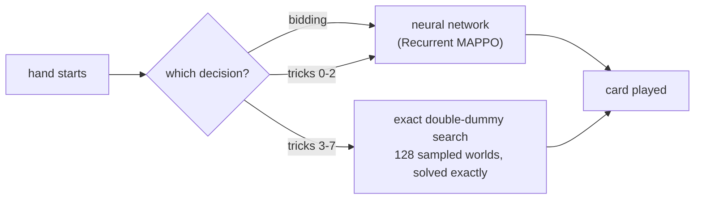

# Belot: a Recurrent MAPPO agent, and the search that beats it

**Belot** is a 32-card, four-player partnership card game — the same family as Belote
and Klaverjas. You never see the other three hands, you cannot tell your partner
anything, and a single hand swings on card luck far more than on skill: the part of
the outcome a player actually *controls* is about **1.2% of its variance**. That makes
it an unusually honest testbed, because almost anything you build looks like it works
until you measure it properly.

This repository trains an agent to play it — and then spends most of its effort
finding out how much of what it does is real.

### It plays live against real people

The agent runs unattended on **belot.md**, a commercial Belot site, over an
undocumented WebSocket protocol I reverse-engineered into a
[separate SDK](https://github.com/MrUnBaiat/belotmd). Across **1,098 scored hands** in
30 sessions: **zero seats lost, zero solver faults, zero fallbacks.**



| | |
|---|---|
| strongest player | network bidding + network tricks 0–2 + exact search from trick 3 |
| **vs. its own trained network** | **+1.270 ± 0.197 pts/hand** (n=1000) — roughly a **62% match win rate** |
| vs. humans, live | +0.29 ± 0.87 pts/hand over the 938 hands where all four seats were human — not yet distinguishable from zero, and [here is why that needs ~2,900](#measuring-strength-against-humans-is-slow) |
| correctness | 89 tests, 16 standalone verification tools, identical-policy control exactly `0.000` |

### The half I would actually point at

The agent **plateaued** after ~3,000 epochs. This repository contains the measurements
that say **why**, what the ceiling is, and which of a dozen plausible fixes are ruled
out — with confidence intervals, pre-registered reading rules, and negative results
reported as results. Seven attempts to break the plateau are documented *with the
evidence that killed them*. See **[docs/RESULTS.md](docs/RESULTS.md)**.

---

## Quick start

```bash
pip install -r requirements.txt

python tools/check_env_rules.py          # game-rule invariants over 3,000 random games
python tools/check_solver.py             # exact solver vs the engine at every state
python tools/check_swap_control.py       # the evaluation instrument's control
pytest -q                                # 89 tests

python scripts/play.py                   # play one hand, card by card
python scripts/evaluate.py --n 500       # reproduce +1.270 ± 0.197  (~4.3 h, D=128)
python tools/dd_depth_sweep.py --n 500    # D=8 vs D=128, paired on deals (~2 h)
python scripts/train.py                  # train from scratch
```

Against real opponents on belot.md (see [Playing real people](#playing-real-people)):

```bash
python tools/verify_online.py FRAMES.jsonl --ckpt CKPT   # pre-flight, gates a run
python scripts/play_online.py --no-search --once         # first run: network only
python scripts/play_online.py --hours 4 --break-min 20   # continuous
python tools/online_report.py                            # pts/hand vs humans, with a CI
```

**Weights are not distributed with this repository.** `scripts/play.py` and
`scripts/evaluate.py` take `--ckpt`; `scripts/train.py` produces one. Everything under
`tools/` that does not need a trained network runs immediately.

---

## Layout

```
belot/
  env.py             the game: dealing, the auction, trick resolution, scoring
  observation.py     513-dim actor view and 332-dim critic view
  model.py           shared-parameter actor-critic; LSTM actor, stateless critic
  memory.py          episodes, GAE, minibatching
  vec_env.py         in-process lockstep vectorisation
  heuristic.py       the fixed greedy reference player
  search/
    dd_solver.py     exact double-dummy solver (alpha-beta over bitboards)
    pimc.py          determinization sampling and rollout PIMC
    composite.py     THE PLAYER: network base + exact search from trick 3
  evaluation/
    swap_eval.py     swap-paired deals; the identical-policy control
    match_eval.py    full matches to 101
  online/
    agent.py         the same player, adapted to a live belot.md table
scripts/             train, play, evaluate, play_online
tools/               16 correctness checks and measurement probes
tests/               pytest suite
docs/                game rules, and the results
```

---

## The architecture

**One parameter set plays all four seats.**

- **Actor** (imperfect information): local observation `(513,)` → 512 → 512 →
  `LSTM(512)` → 38 actions, illegal actions masked before the categorical.
- **Critic** (perfect information, stateless): global observation `(332,)` → 512 →
  512 → 1. The global view contains all four hands — centralised training,
  decentralised execution.

**In-process lockstep vectorisation.** N independent environments in one process,
batching the one expensive shared operation — the forward pass — rather than paying
multiprocessing overhead. LSTM state is tracked per `(env, seat)` and advanced only
when that seat acts. Episodes still in flight at a rollout boundary are discarded, so
every stored trajectory is complete and the GAE bootstrap is unconditionally zero.

**Rewards are dense but the objective is not.** Each trick pays `±points/162`, and a
terminal true-up corrects every seat so that its episode rewards sum **exactly** to
`(gp_us − gp_them)/16`. The two disagree hand by hand — 162 raw card points map
non-linearly onto 16 game points, and a declaring team on 80 or fewer scores zero —
so the identity is asserted directly rather than assumed
(`tools/check_reward_identity.py`, ~1e-16).

**The search.** From trick 3, sample D worlds consistent with everything the acting
seat can see, solve each exactly for every legal card, convert raw points to game
points, and play the best total. Before trick 3 the network plays: with 24 unseen
cards a single world's verdict is nearly uninformative, and searching there was
measured at **−0.348 ± 0.309** — significantly worse.

**D = 128.** Worth **+0.435 ± 0.208** over D=8, swap-paired on identical deals and
replicated on 500 deals no earlier run had touched (bootstrap `[+0.226, +0.645]`,
sign test `p = 0.00007`). This corrects an earlier claim in this repository that the
determinization axis was flat — it is flat near 8 and rises by 128. It is nearly free:
a D=128 decision runs **0.20 s median** against belot.md's 25 s turn clock, though the
tail reaches **23 s** at trick 3, where the belief is widest. See
[docs/RESULTS.md §3.1](docs/RESULTS.md).

---

## How the numbers were measured

Belot's per-hand outcome swings by tens of game points on card luck, so an unpaired
comparison of two decent policies is mostly noise. Every strength figure here uses
**swap-paired deals**: each deal is played twice with the seat pairs exchanged, and
the edge is `(dA − dB)/2`. Identical policies then cancel **deal by deal**, so the
control returns exactly `0.000` with `max|edge|` exactly `0` — and when it does not,
nothing from that run counts. Measured variance reduction: 1.9×–2.3× in standard
deviation.

Every figure carries a 95% confidence interval and its sample size, reading rules
were fixed before each measurement ran, and results that came out negative are
reported as results.

---

## What did not work, and why

The agent plateaued after ~3,000 epochs, and the reason is structural: the
policy-gradient update is **exactly zero** for a decision taken with probability
1.000, and measured participation is **10.8%** — about one decision in nine carries
any gradient. 660 further epochs were worth **+0.089 ± 0.286**.

Seven attempts to get past that are documented with their measurements in
[docs/RESULTS.md](docs/RESULTS.md), including a learned search evaluator, a learned
belief network, expert iteration, two observation redesigns and Deep Monte Carlo on
both card play and bidding. They share one cause: **the action-controllable part of a
Belot outcome is about 1.2% of its variance**, so a value function trained on realised
returns learns which deal it is holding rather than which card to play. The methods
that work are the ones that *pair* the comparison and cancel the state term — which is
what the search does.

---

## Playing real people

Every number above was measured against the agent itself or a frozen copy of it. The
one opponent population none of it touched is human, so the player also runs live on
belot.md through a separate SDK, `belotmd`, which owns the platform half: joining,
auth, reconstructing a game state from a partial and often stale server feed,
declarations, the seven-swap, retrying refused moves, moving on to a new table when
one dissolves, and recording every raw frame.

This repository supplies only the decision. `belot/online/agent.py` reuses the same
encoder, the same network and the same solver as the offline player — there is no
second copy of any of them to drift — and routes identically: bidding and tricks 0–2 to
the network, tricks 3–7 to the exact search.

**Four things are genuinely different online**, and each is handled rather than
assumed away:

- **You cannot see the other hands.** The server publishes placeholders of the correct
  *length* for the other three seats, so reading them searches a fantasy and never
  errors. All hidden-state information is read through the SDK's constraint bundle.
- **Declared combinations pin cards.** A declared five-card run proves five specific
  cards, and the SDK writes those into `known_cards` — which our encoder already reads.
  So the worlds sampled online are *better* constrained than the ones the offline
  numbers were measured with. The SDK also reads a run's EDGES: a declared run is
  reported maximally, so the ranks just outside it are provably not held — about 3.7
  extra excluded cards per hand, validated at 143 exclusions and **zero** false voids
  against fully-known hands.
- **The hand is scored differently.** belot.md counts declared combinations in the bolt
  threshold and in the stakes; the offline simulator has no concept of them, so the
  search was aiming at a fixed line of 81 that the real game **moves on two hands in
  three**. The rule was reconstructed from 897 recorded hands and reproduced on every
  one; correcting the search is worth **+0.174 ± 0.122 pts/hand** over 2,000 paired
  deals. See [docs/RESULTS.md](docs/RESULTS.md) §3.
- **There is a clock, and overrunning costs the seat.** 25 s to play a card; miss it
  and belot.md hands the seat to its own bot for the rest of the session, after which
  every message is ignored while the log keeps printing the cards we chose. The search
  budgets against the deadline with a margin and never returns late. Measured on real
  captured positions at the deployed D=128: **0.52 s median, 7.94 s worst** on the first
  recordings; over an 11.5 h run of 4,238 decisions the worst was **23.2 s**, the guard
  cut 35 of 169,088 worlds, and no seat was lost. Trick 0 is out of reach at any D — one
  solve there costs 8.2 s.

`tools/verify_online.py` gates a run on five checks — rules parity against the SDK's
rulebook (50,000 states, 0 disagreements), world legality, encoder parity, action
parity against a saved baseline, and timing.

`scripts/play_online.py` adds only what the SDK deliberately leaves to the account's
owner: it counts seat takeovers **as they happen** and stops after a few, paces play
into bounded stretches with breaks, and stops a run that has received no frames at
all for two hours — because the SDK retries an empty lobby every five minutes
forever, and an expired cookie looks exactly the same from outside it. Every stop
waits for the end of the current hand.

### What live play has measured

32 recordings, 119 matches, **1,098 scored hands** across 30 sessions. Of 9,144
decisions (29.7% of them searched): **zero seats lost, zero solver faults, zero
fallbacks, zero infeasible constraint sets.** The worst single decision took 23.3 s of
the 25 s turn clock — inside the deadline guard's margin, which exists because
overrunning is the one failure that would cost the seat.

**One hand in seven was not against four humans.** belot.md replaces a player whose
turn times out with its own bot, and often hands the seat back a few hands later; 160
of the 1,098 hands had that bot in another seat (113 opponent, 61 partner). The
recordings carry only a per-frame flag for it, so `tools/online_report.py` tags every
hand and quotes strength on the rest.

Strength against humans is **+0.29 ± 0.87 pts/hand (n=938, all four seats human)** —
still not distinguishable from zero, which is exactly what the table below predicts at
this sample size. Across all 1,098 hands it is +0.44 ± 0.80; with a bot opponent it was
+1.89 ± 2.24, the direction that made mixing them flattering. Throughput is about 42
hands/hour, so ±0.5 needs roughly 50 more hours.

### Measuring strength against humans is slow

There is no swap-paired control online: a deal cannot be replayed with the seats
exchanged. The instrument is the raw per-hand mean, whose standard deviation is about
13.6 game points — dozens of times the effect being looked for:

| target interval | all-human hands needed |
|---|---|
| ±1.0 pts/hand | ~710 |
| ±0.5 pts/hand | ~2,850 |
| ±0.25 pts/hand | ~11,400 |

`tools/online_report.py` prints the current interval beside those targets, so it is
obvious when a number is still noise.

Recordings are kept out of this repository: they contain other players' usernames and
account ids.

## Requirements

Python 3.10+, PyTorch, NumPy. `pytest` for the tests, `tensorboard` for training
curves. See `requirements.txt`.

## License

MIT — see [LICENSE](LICENSE).
